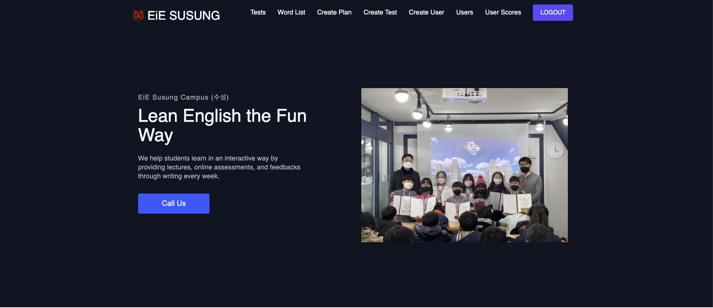
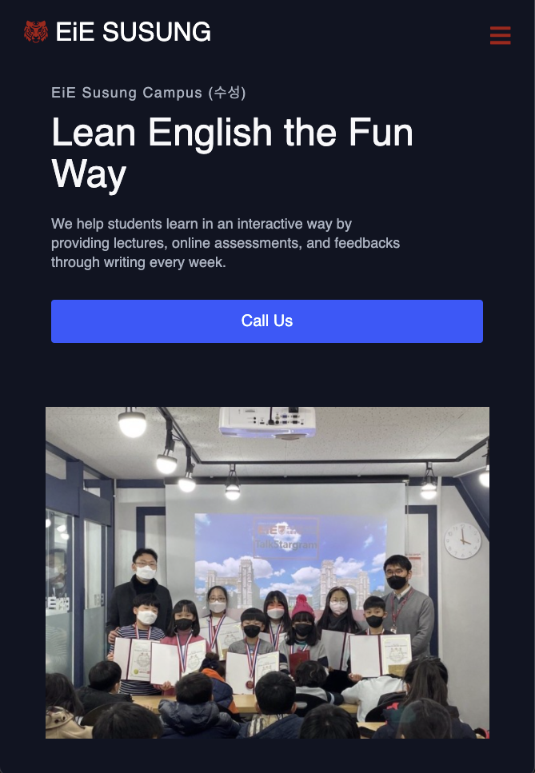
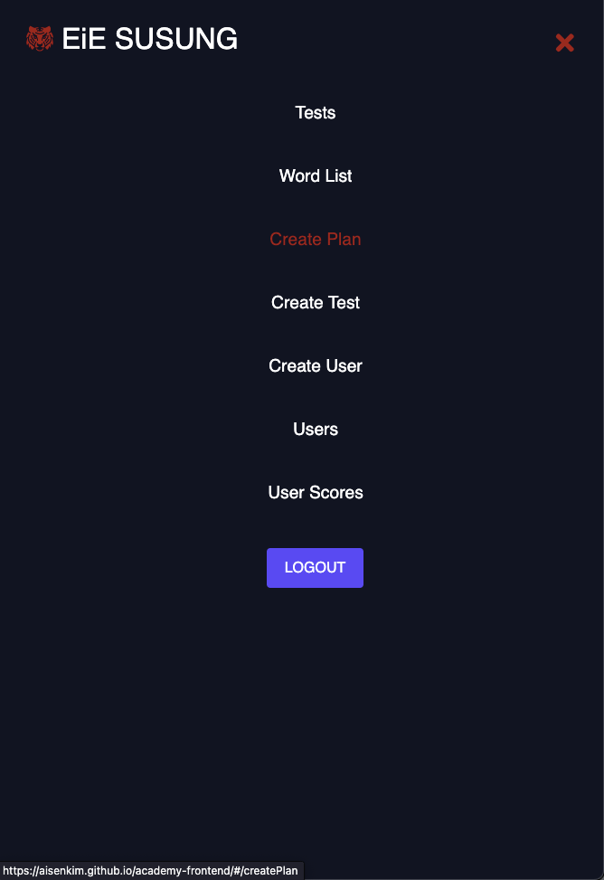

# Academy App 
> This is an app created during the pandemic to help elementary school students at an english academy called EIE to take exams online.
> Live demo [_here_](https://aisenkim.github.io/academy-frontend/#/) (**Check Setup section for username**). <!-- If you have the project hosted somewhere, include the link here. -->

## Table of Contents
* [General Info](#general-information)
* [Technologies Used](#technologies-used)
* [Features](#features)
* [Screenshots](#screenshots)
* [Setup](#setup)
* [Project Status](#project-status)
* [Room for Improvement](#room-for-improvement)
* [Contact](#contact)
<!-- * [License](#license) -->

## General Information
- During the pandemic, students at the english academy weren't able to take in-person vocab tests and was difficult for teachers at the academy to keep track of student's progress. 
- Created an app for the academy called EiE Susung Campus which had 80 students.
- Students were able to easily access vocabulary list from the website to study and take exams without having to come to the academy.

## Technologies Used
- React JS - version 17.0
- Bootstrap - version 5 

## Features
- View wordlist from anywhere anytime from a mobile phone 
- Students able to take exams / retests (if failed) at home 
- Teachers able to keep track of student's progress 
- Teachers able to create plans, check answers (able to mark correct or incorrect after reviewing), create word lists for different levels, register new users, and more!
- Able to search student's records by username, name, or level

## Screenshots

<figcaption><b>home page (desktop view)</b></figcaption> 

<figcaption><b>home page (mobile view)</b></figcaption> 

<figcaption><b>nav bar (mobile view)</b></figcaption> 

<figcaption><b>exam page walk through</b></figcaption> 

<figcaption><b>word list page walk through</b></figcaption> 

<figcaption><b>search by username, name, or level</b></figcaption> 

<figcaption><b>view student's answers and able to edit(correct / wrong)</b></figcaption>

## Setup
#### local machine setup
1. `npm install`
2. `npm start`
3. Clone backend from [here](https://github.com/aisenkim/academy-refactor)
 
#### hosted site testing
🔑 username - manager  
🔑 password - eiesusung2020!

[comment]: <> (## Usage)

[comment]: <> (How does one go about using it?)

[comment]: <> (Provide various use cases and code examples here.)

[comment]: <> (`write-your-code-here`)

## Project Status
Project is: _in progress_  

## Room for Improvement
Still need to improve UI and add more features

Room for improvement:
- Improve algorithm for checking answers
- Apply tests using jest
- Provide word bank 
- Add games for students to learn vocabs faster in a fun way

## Contact
Created by [@aisenkim](https://www.linkedin.com/in/aisenkim/) - feel free to contact me!

<!-- Optional -->
<!-- ## License -->
<!-- This project is open source and available under the [... License](). -->

<!-- You don't have to include all sections - just the one's relevant to your project -->
